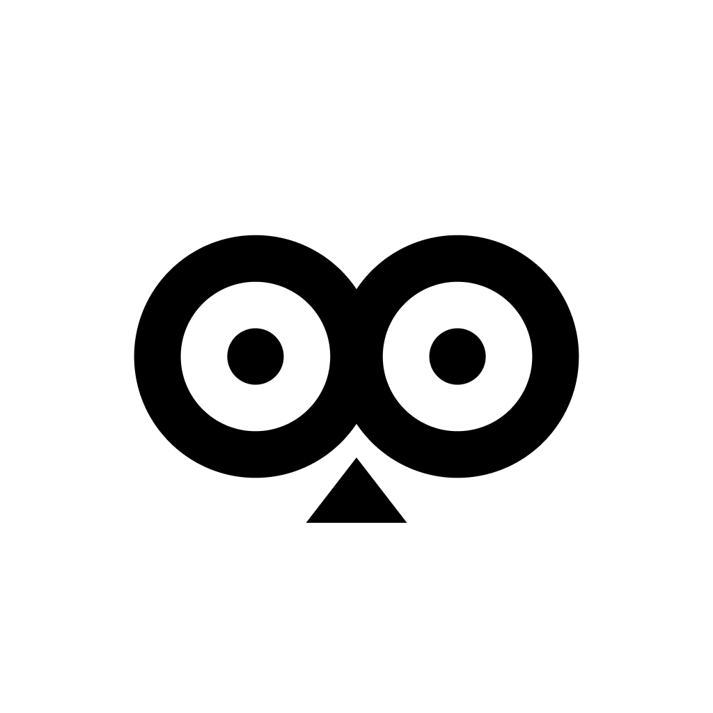

# OwLens



🦉**OwLens** is a professional-grade iOS camera application designed for filmmakers and power users who want maximum control over their video capture. It bypasses Apple's standard image signal processor (ISP) pipeline, capturing uncompressed 14-bit RAW sensor data and encoding it directly into HEVC S-Log3 in real-time using custom Metal shaders.

## Features

- **True RAW to S-Log3 Pipeline:** Captures uncompressed RAW Bayer sensor data (Bayer14) and debayers it on the GPU, applying a true S-Log3 transfer function before saving as 10-bit HEVC. Unprocessed video straight from the sensor — no artificial sharpening, noise reduction, or local tone mapping from the Apple ISP.
- **Real-Time GPU Denoising:** Spatial bilateral denoise on luma + cross-bilateral half-res chroma denoise + 3-frame ring-buffer temporal averaging with per-frame motion gating. Strength is user-adjustable from 0.0–1.0 via the Denoise panel controls.
- **Open Gate 4:3 Capture:** Captures the full sensor aspect ratio without cropping to 16:9, providing maximum vertical resolution and reframing flexibility in post.
- **Constant Frame Rate (CFR):** Locked 24fps or 30fps files — holds the last valid frame if one drops, ensuring perfectly synced audio in Premiere Pro and DaVinci Resolve.
- **Manual Controls:** Full manual control over ISO (device min–max), shutter angle (continuous magnetic slider with cinematic snap targets), and White Balance (Kelvin).
- **Focus Control:** Continuous auto-focus when unlocked. Tap-to-focus locks at the tapped point during recording. Focus peaking (green edge highlight) for zero-overhead manual focus tracking.
- **User-Adjustable Denoise:** Slider-controlled denoise strength (0.0–1.0) in the status strip. Higher values provide stronger noise reduction at increased GPU cost. Warning indicator shows when strength exceeds 0.5.
- **Dynamic Lens Switching:** Automatically detects all available single-lens physical cameras (Ultra Wide, Wide, Telephoto) and allows seamless switching.
- **Audio Control:** Supports external microphones (USB, Headset, Bluetooth) and built-in mic. Real-time audio level monitoring.
- **Professional Overlays:** Rule-of-thirds grid, real-time hardware gyroscope level overlay, clipping indicators (zebras), and RGB histogram + waveform scope.

## How it Works

OwLens bypasses standard iOS image processing using a three-stage custom pipeline:

1. **Direct Sensor Access:** Captures uncompressed 14-bit RAW Bayer sensor data via AVCapturePhotoOutput, bypassing Apple's built-in noise reduction, sharpening, and tone-mapping.
2. **Metal-Accelerated GPU Pipeline:** A suite of Metal compute shaders runs on the GPU: defect pixel correction → Malvar-He-Cutler directional demosaic with LSC and WB → bilateral spatial/temporal denoise → Sony S-Log3 transfer function.
3. **Hardware Encoding:** The log-encoded texture is written to a CVPixelBuffer and fed to the iPhone's HEVC hardware encoder at up to 150 Mbps, maintaining a constant frame rate (CFR) to ensure audio sync.

### Recording Quality by Resolution

| Format | Resolution | Denoise | Bitrate |
|--------|-----------|---------|---------|
| Open Gate 4:3 | 1920×1440 | Full (spatial + chroma + temporal) | Up to 150 Mbps |
| 1080p 16:9 | 1920×1080 | Full (spatial + chroma + temporal) | Up to 150 Mbps |
| 4K 16:9 | 3840×2160 | Light (previewFast quality, radius=2) | Up to 150 Mbps |

## Color Grading in DaVinci Resolve

When importing OwLens footage into DaVinci Resolve, use the following settings in a **Color Space Transform (CST)** node to map the colors and contrast correctly:

- **Input Color Space:** Sony S-Gamut3.Cine
- **Input Gamma:** Sony S-Log3

## Installation

You'll need:

- A Mac running Xcode 15 or later
- An Apple ID (a free account is enough to install on your own device)
- Any iPhone running iOS 17 or later connected via cable, or on the same Wi-Fi network as your Mac

### Steps

1. Download the project:
   ```bash
   git clone https://github.com/[your-username]/owlens.git
   cd owlens
   ```
2. Open the project:
   ```bash
   open OwLens.xcodeproj
   ```
3. Sign the app with your Apple ID:
   * In Xcode, click the **OwLens** project in the left sidebar.
   * Under **Signing & Capabilities**, select your name under **Team**. (If you don't see your Apple ID listed, go to **Xcode** → **Settings** → **Accounts** and add it there first.)
4. Connect your iPhone to your Mac, and select it as the run destination from the device dropdown at the top of the Xcode window.
5. Run it: press **Cmd + R**, or click the ▶️ button.
6. Trust the developer certificate on your iPhone (first run only):
   * Go to **Settings** → **General** → **VPN & Device Management** on your iPhone.
   * Tap your Apple ID under "Developer App," then tap **Trust**.

That's it, OwLens will launch on your phone. 🦉   

## License

OwLens is a source-available project. The source code is provided for personal, educational, and evaluation purposes only. Commercial exploitation, distribution, and publishing to any public app store (including the Apple App Store) are strictly prohibited. Refer to the [LICENSE](LICENSE) for full terms.
